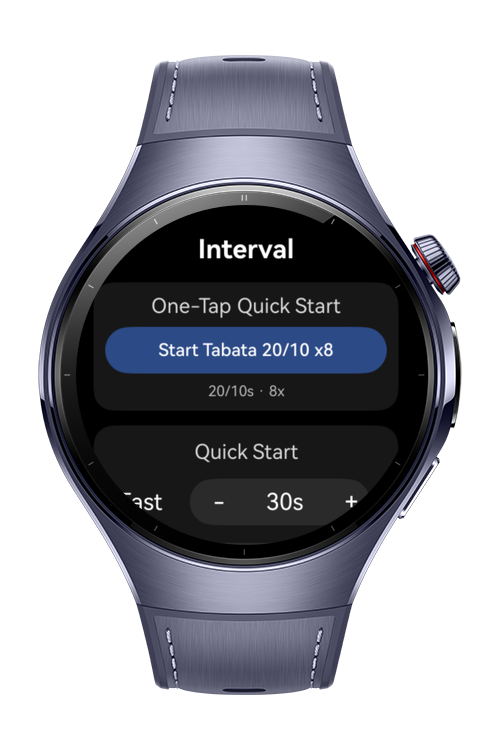
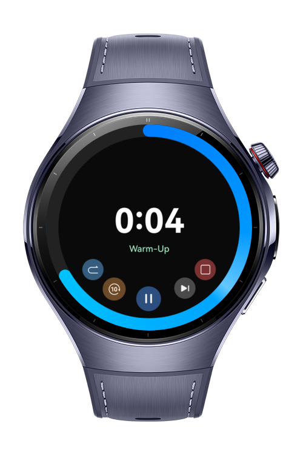
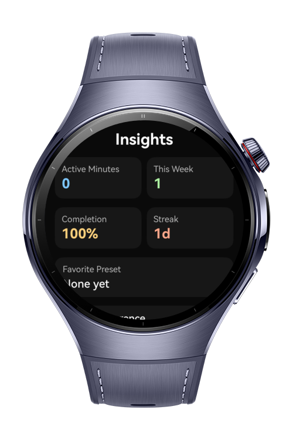

> **Note:** To access all shared projects, get information about environment setup, and view other guides, please visit [Explore-In-HMOS-Wearable Index](https://github.com/Explore-In-HMOS-Wearable/hmos-index).

# Interval Clock
This project demonstrates a sample application for Huawei Wearable Devices that runs with HarmonyOS Next.
It is an interval clock sample app for sports & outdoor users.

# Preview

<div>



</div>

# Use Cases
1. Customizable Intervals: Users can easily set work and rest durations, along with the number of rounds, to match workouts, study sessions, or breathing exercises.
2. Hands-Free Workout Guidance: The app guides users through each phase without needing constant screen interaction.
3. Minimal Watch Interface: Designed for simplicity, the smartwatch display shows only the most essential details such as current phase, remaining time, and rounds left.
4. Quick Routine Access: Favorite and recently used routines can be launched with one tap from the dashboard or from the preset library.
5. Personalized Routine Management: Users can create, edit, favorite, and delete custom routines directly on the watch.
6. Session Review and Trends: Completed sessions are stored so users can review history, completion status, streaks, and simple adherence insights.
7. Daily Habit Support: A daily reminder schedule can be configured and persisted from Settings.
8. Watch Coaching Controls: Warm-up, cool-down, keep-awake behavior, round labels, and haptic intensity can be adjusted for a more complete coaching flow.

# Directory Structure

   ```
entry/src/main/ets/
|---common
|---|---constants
|---|---|---TimerConstants
|---|---models
|---|---routing
|---data
|---|---repositories
|---pages
|---|---History
|---|---Insights
|---|---Presets
|---|---SessionSummary
|---|---Settings
|---|---Timer
|---|---|---Timer
|---|---Index
|---viewmodel
|---|---DailyReminderService
|---|---HapticCoachService
|---|---HistoryInsightsService
|---|---TimerService
|---entryability
|---|---EntryAbility
|---entrybackupability
|---|---EntryBackupAbility
   ```

# Tech Stack
- Languages: ArkTS
- Frameworks: HarmonyOS SDK 5.0.2(14)
- Tools: DevEco Studio Version 5.1.0.842
- Libraries: @kit.ArkUI, @kit.AbilityKit, @kit.SensorServiceKit, @kit.CoreFileKit, @kit.PerformanceAnalysisKit
- HarmonyOS Capabilities: wearable navigation, haptic feedback, persistent settings storage, session recovery, and reminder-state persistence

# Constraints and Restrictions

### Supported Devices
- Huawei Watch 5

# License
**IntervalClock** is distributed under the terms of the MIT License.
See the [LICENSE](./LICENSE) for more information.
